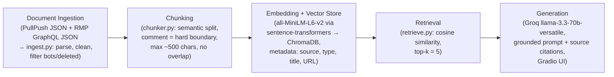

# Project 1 Planning: The Unofficial Guide

> Write this document before you write any pipeline code.
> Your spec and architecture diagram are what you'll use to direct AI tools (Claude, Copilot, etc.) to generate your implementation — the more specific they are, the more useful the generated code will be.
> Update the Retrieval Approach and Chunking Strategy sections if you change your approach during implementation.
> Update this file before starting any stretch features.

---

## Domain

Student life and academics at Colby College (Waterville, Maine). I go to Colby, and there is a huge gap between what the admissions site tells you and what students actually tell each other. The official channels will never tell you that freshmen basically get no say in their housing beyond a substance-free checkbox, that the dorms (except the Johnson Pond houses) have no AC, what Doghead actually is, or which CS professors answer their emails fast. That knowledge lives in r/Colby threads and Rate My Professors reviews, and it's scattered across years of posts that nobody is going to scroll through. My system makes that searchable: ask a plain question about life at Colby, get an answer grounded in what real students wrote, with the source attached.

---

## Documents

19 documents total: 13 r/Colby threads (each thread = post + all its comments = one document) and 6 Rate My Professors pages for Colby CS professors (each professor's full review set = one document).

A note on collection: Reddit blocks direct API requests from my machine (403 on every host I tried), so the threads were pulled through the PullPush archive API (api.pullpush.io), which mirrors Reddit submissions and comments. The RMP reviews came from RMP's own GraphQL endpoint, which serves the same public data the professor pages render. Raw JSON for everything is saved in `data_raw/`.

| # | Source | Description | URL or location |
|---|--------|-------------|-----------------|
| 1 | r/Colby thread | "I got into Colby a few days ago, and I wanted to ask some questions :)" — big Q&A: food, dorms, traditions, weather, stress (21 comments, 2022) | reddit.com/r/Colby/comments/tkrwaw/ |
| 2 | r/Colby thread | "Questions for Colby students / alumni :))" — social life, adjusting, food debate, dorm conditions (19 comments, 2022) | reddit.com/r/Colby/comments/txeni4/ |
| 3 | r/Colby thread | "Q&A for Prospective students:" — JanPlan rules, workload, course recs (18 comments, 2022) | reddit.com/r/Colby/comments/tq60un/ |
| 4 | r/Colby thread | "Choosing courses for freshman year" — how many classes to take, MA161, skipping CS151 (18 comments, 2021) | reddit.com/r/Colby/comments/n4v3ml/ |
| 5 | r/Colby thread | "Can i get some advice?" — admissions advice, ED, international students (17 comments, 2024) | reddit.com/r/Colby/comments/1es4ej8/ |
| 6 | r/Colby thread | "Banned Items at Colby Dorms?" — appliances, AC, what you can bring (14 comments, 2022) | reddit.com/r/Colby/comments/znvc3i/ |
| 7 | r/Colby thread | "Best language?" — which language course to take (10 comments, 2023) | reddit.com/r/Colby/comments/14rqze0/ |
| 8 | r/Colby thread | "Is the social life here bad?" — drinking culture, fitting in without drinking (7 comments, 2023) | reddit.com/r/Colby/comments/1363wjz/ |
| 9 | r/Colby thread | "Is the food actually that bad?" — dining hall opinions (6 comments, 2021) | reddit.com/r/Colby/comments/md5xv5/ |
| 10 | r/Colby thread | "housing for freshman" — freshman housing process (6 comments, 2022) | reddit.com/r/Colby/comments/v1vydc/ |
| 11 | r/Colby thread | "So freshmen have no say on their housing?" — housing form details, accommodations (5 comments, 2023) | reddit.com/r/Colby/comments/18pfyod/ |
| 12 | r/Colby thread | "AS231 (Introduction to Astrophysics) Review and Advice" — course-specific review (4 comments, 2024) | reddit.com/r/Colby/comments/1dx0v18/ |
| 13 | r/Colby thread | "Winter coat and boots recommendations?" — surviving Maine winter (3 comments, 2024) | reddit.com/r/Colby/comments/1cp7ve6/ |
| 14 | Rate My Professors | Dale Skrien, CS (16 reviews) — no longer at Colby but the reviews are still useful history | ratemyprofessors.com/professor/364345 |
| 15 | Rate My Professors | Oliver Layton, CS (12 reviews) | ratemyprofessors.com/professor/2442672 |
| 16 | Rate My Professors | Stephanie R. Taylor, CS (11 reviews) | ratemyprofessors.com/professor/1327389 |
| 17 | Rate My Professors | Bilal Ahmad, CS (11 reviews) | ratemyprofessors.com/professor/1841040 |
| 18 | Rate My Professors | Maximillian Bender, CS (8 reviews) | ratemyprofessors.com/professor/2899686 |
| 19 | Rate My Professors | Allen Harper, CS (6 reviews) | ratemyprofessors.com/professor/2867220 |

I originally also collected a 14th thread ("The Waterville Secret that Everyone Knows") but cut it after reading it — it's local true-crime gossip about a named private person, not student-life knowledge, and I don't want my system citing it.

---

## Chunking Strategy

**Chunk size:** semantic chunks with a max cap of ~500 characters (roughly 100–125 tokens). No fixed size — chunks end where the topic shifts or where the natural unit (a comment or a review) ends.

**Overlap:** none (0).

**Reasoning:**

My corpus is almost entirely short, self-contained units: Reddit comments and RMP reviews. A single comment like "Heaters, yes. Air conditioners are in the Johnson pond houses only... bring a fan!" is already a complete retrievable thought. So the chunker works like this:

1. A comment or review is the hard boundary — a chunk never spans two different people's comments, because gluing two people's opinions together would create chunks that say two unrelated things (and would make attribution wrong).
2. Most comments are under 500 characters and just become one chunk each.
3. Long comments (some run 800–1500 characters and cover multiple topics, like one that covers winter weather AND summer AND the campus) get split *semantically*: embed each sentence, find the spots where similarity between adjacent sentences drops, and split there, capping every chunk at ~500 characters.

Why no overlap: since the natural unit here is one person's complete comment, overlap would mostly just duplicate short comments. I'm choosing precision over insurance. The risk I'm accepting (see Anticipated Challenges) is that when a long comment does get split, a fact spanning the split point may end up retrievable from neither half.

How I'd know the chunks are wrong: too small → fragments like "Professor Smith's exams are heavily" that match nothing meaningfully; too large → one chunk holding food opinions plus housing advice, which dilutes the embedding and matches specific queries weakly. The checkpoint is printing random chunks and asking whether each one could answer a question on its own.

Expected chunk count: ~150 comments/reviews plus posts, with some long ones splitting into 2–4 chunks → somewhere in the 200–350 range, comfortably inside the 50–2,000 sanity window from the instructions.

---

## Retrieval Approach

**Embedding model:** `all-MiniLM-L6-v2` via sentence-transformers, running locally. 384-dim embeddings, 256-token input window — my capped chunks (~125 tokens max) fit well inside it.

**Top-k:** 5. With chunks this small, a single chunk is one person's opinion; 5 gives the LLM a few perspectives to synthesize (which matters for contested topics like food quality) without burying it in loosely related comments. I'll revisit after seeing real retrieval results.

**Vector store:** ChromaDB (local, persistent), cosine distance. Each chunk stored with metadata: source document name, source type (reddit / rmp), thread title or professor name, URL, and chunk position.

**Production tradeoff reflection:** If this were a real product for students I'd think about: (1) cost and privacy — MiniLM is free and local, an API model like OpenAI's text-embedding-3 or Cohere embed costs per token and ships student queries to a third party; (2) accuracy on domain slang — terms like "JanPlan," "Doghead," and course codes like "MA161" are exactly where a small general-purpose model is weakest, and a larger model (or fine-tuning) would likely retrieve named things better; (3) context length — 256 tokens is fine for my small chunks but would force awkward chunking if I ever ingested long guides or handbooks; (4) multilingual support — irrelevant for r/Colby, but a system for international applicants might want queries in other languages, which MiniLM handles poorly; (5) latency — local inference on CPU is actually faster than an API round-trip at my scale, but wouldn't scale to thousands of concurrent users without GPU serving.

---

## Evaluation Plan

| # | Question | Expected answer |
|---|----------|-----------------|
| 1 | What is Doghead and when does it happen? | Colby's biggest tradition: a St. Patrick's Day-style celebration on the weekend before spring break where people stay up all night, and whoever makes it through watches the sunrise. |
| 2 | Can freshmen choose their dorm at Colby? | No. The only real preference is requesting substance-free housing; freshmen fill out a questionnaire (sleep hours, tidiness, sociability, LGBTQ/ally) used for roommate matching and are placed in designated freshman buildings. |
| 3 | Do Colby dorms have air conditioning? | No — only the Johnson Pond houses have AC. Students say to bring a fan, and you only really want AC for about two weeks of the year. Heaters yes. |
| 4 | Which dining halls do students recommend for lunch vs dinner? | One student's favorite combo: lunch at Foss, dinner at Bob's. Students also recommend checking the menus because different halls are better on different days (Dana's station is described as having about a 70% hit rate). |
| 5 | How many on-campus Jan Plans are students expected to complete? | Three on-campus JanPlans over their time at Colby, and freshman year is expected to be one of them. Personal alternatives can be proposed but take effort. |

---

## Anticipated Challenges

1. **Contradictory opinions across documents.** The food question is the obvious one: a 2021 thread says the food is "pretty good," a 2022 thread says "food quality is ass," and another 2022 comment claims food poisoning is now a major issue. If retrieval pulls only one side, the answer will look confident and be misleading. The system should attribute opinions ("one student said X, another said Y") rather than flatten them into one verdict — that's a prompt-design requirement, not just a retrieval one.

2. **Single-chunk facts.** Some answers exist in exactly one comment in the whole corpus (the Foss-for-lunch/Bob's-for-dinner recommendation is one sentence by one person). If that chunk isn't in the top-5 — because the query phrasing doesn't match, or the comment got split badly — generation has nothing to work with. Eval question 4 is deliberately one of these, so my evaluation has a realistic chance of surfacing a failure.

3. **Leftover noise from Reddit.** The raw threads contain bot comments (a book bot, a grammar bot, "bad bot" replies), `[deleted]`/`[removed]` placeholders, markdown links, and HTML entities like `&amp;` and `&gt;`. If cleaning misses these, they become garbage chunks that can outrank real content. The cleaning step needs explicit filters for bot signatures and deleted content, and I need to actually read printed chunks before embedding.

4. **Domain-specific names.** MiniLM has never particularly seen "JanPlan," "Doghead," "Foss," or "MA161" as meaningful tokens. Queries using those names may retrieve weakly even when an exact-match chunk exists. This is the main reason hybrid BM25 + semantic search is on my stretch list — keyword search handles exact names where embeddings are fuzzy.

---

## Architecture

---

## AI Tool Plan

My main tool is Claude (Claude Code). The deal I'm making with myself: I decide the spec (this file), Claude generates implementation from specific sections of it, and I read and test what comes back before building on it.

**Milestone 3 — Ingestion and chunking:** I'll give Claude my Documents section (the raw data is PullPush/RMP JSON in `data_raw/`) and my Chunking Strategy section, and ask for two scripts: `ingest.py` (parse the JSON, strip bot comments, deleted placeholders, markdown junk, HTML entities, output cleaned per-document text) and `chunker.py` (semantic chunking exactly as specced: comment-level hard boundaries, sentence-embedding splits, 500-char cap, no overlap). I'll verify by printing one cleaned document and reading it, then printing 5+ random chunks and checking each stands alone.

**Milestone 4 — Embedding and retrieval:** I'll give Claude my Retrieval Approach section and the architecture diagram and ask for `embed_store.py` (embed chunks with all-MiniLM-L6-v2, store in ChromaDB with the metadata fields above) and a `retrieve(query, k=5)` function returning chunks + sources + distances. I'll verify by running at least 3 of my eval questions and checking the returned chunks are actually relevant and distances on top hits are under ~0.5 (Chroma cosine distance). If anything in the ChromaDB API looks unfamiliar I'll have Claude explain it before I use it.

**Milestone 5 — Generation and interface:** I'll give Claude the grounding requirement (answer ONLY from retrieved context, refuse when the context doesn't cover the question, never invent), the output format (answer + source list appended programmatically, not left up to the LLM), and ask for `query.py` (Groq llama-3.3-70b-versatile) plus a Gradio `app.py`. I'll verify with 2–3 real queries and one out-of-scope question ("What's the parking situation at Bowdoin?" type) to confirm it refuses instead of improvising.

---

## Stretch Features (planned before implementation)

**Chunking strategy comparison (+1).** Compare three chunkers on the same 5 eval queries: (a) my semantic chunker, (b) recursive character splitting (split on paragraph → sentence → word boundaries, 500 chars, 50 overlap), (c) fixed-length 500 chars with no regard for boundaries. Build three separate Chroma collections, run the eval queries against each, and compare which retrieves the right chunk(s) and at what distance. Report which won and my best explanation of why.

**Hybrid search (+2).** BM25 keyword scoring (rank-bm25) over the same chunks, combined with semantic scores by reciprocal rank fusion (RRF) — fuse the two ranked lists rather than mixing raw scores, since BM25 and cosine scores aren't on the same scale. Compare hybrid vs semantic-only on at least 3 queries, especially ones with exact names ("JanPlan", "Foss", professor names) where BM25 should shine.
